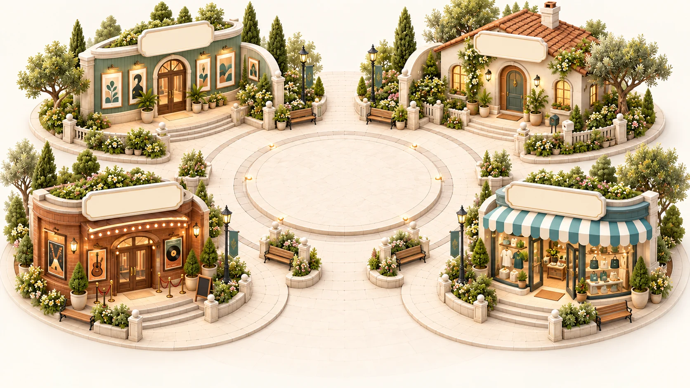

# VieWorld — một thế giới, cùng nhau

<div align="center">


**Một fan world ấm cúng, nơi fan khám phá nghệ sĩ, gặp nhau trong những khoảnh khắc chung, giữ lại kỷ niệm và mua merch khi điều đó thật sự phù hợp.**

</div>



## VieWorld là gì?

VieWorld là nguyên mẫu sản phẩm fandom do **Phạm Thanh Phú** thiết kế và phát triển. Sản phẩm không đặt platform hay cửa hàng ở trung tâm; nhân vật chính của trải nghiệm là mối quan hệ giữa fan, nghệ sĩ và cộng đồng.

Thay vì một dashboard chứa nhiều module rời rạc, VieWorld dùng hình ảnh một thế giới có thể ghé thăm. Quảng trường là điểm bắt đầu chung, còn từng địa điểm đảm nhiệm một vai trò rõ ràng trong fan journey.

```text
Quảng trường
  → Explore: tìm nghệ sĩ và world phù hợp
  → Moments: theo dõi hoạt động, lịch hẹn và tham gia live
  → My Space: thể hiện danh tính fan và giữ bộ sưu tập
  → VieSHOP: thử, chọn và mua đúng phiên bản sản phẩm
  → Quay lại cho khoảnh khắc tiếp theo
```

## Năm không gian chính

| Không gian | Vai trò trong hành trình | Những gì fan làm được |
|---|---|---|
| **Quảng trường** `/` | Bản đồ chung và điểm trở về | Nhìn thấy bốn điểm đến, chọn nơi muốn ghé, trở về My Space qua avatar trung tâm |
| **Explore** `/explore` | Trang chủ nghệ sĩ và discovery | Tìm nghệ sĩ/chương trình, xem world nổi bật, hoạt động mới và quản lý danh sách đang theo dõi |
| **Moments** `/moments` | Ngôi nhà hoạt động của từng nghệ sĩ | Chọn nghệ sĩ, xem feed, lịch, live/concert, hall cộng đồng và merchandise liên quan |
| **My Space** `/me` | Danh tính và tài sản của fan | Tùy biến avatar, trưng bày năm loại kỷ vật, duyệt bộ sưu tập, xem Fandom Pass và quyền riêng tư |
| **VieSHOP** `/shop` | Commerce nằm trong fan journey | Lọc theo nghệ sĩ/loại sản phẩm, phân biệt Physical–Digital–Duo, thử đồ, thêm giỏ và theo dõi đơn |

`/artists` vẫn được giữ làm alias tương thích cho các deep link Explore cũ.

## Fan journey hiện tại

### 1. Khám phá và theo dõi

- Explore ưu tiên world đang theo dõi, hoạt động gần đây và discovery thay vì hiển thị một danh mục khô cứng.
- Tìm kiếm hỗ trợ tiếng Việt không dấu và lọc theo nghệ sĩ, chương trình hoặc trạng thái live.
- Mỗi world dẫn sang đúng Moments của nghệ sĩ, không tạo một giao diện platform thứ hai.

### 2. Hẹn gặp và tham gia Moments

- Trạng thái phiên được thể hiện trung thực: `scheduled`, `open`, `running`, `paused`, `ended` hoặc `cancelled`.
- Live, lobby mở sớm và lịch sắp tới là ba trạng thái khác nhau; vào lobby không được tính là đã tham dự live.
- Fan có thể RSVP, chat có kiểm duyệt, gửi câu hỏi, bình chọn và nhận capsule khi đủ điều kiện tham dự.
- Replay không giả lập sự hiện diện trực tiếp và không tự cấp vật phẩm live.

### 3. Giữ kỷ niệm và thể hiện bản thân

- Avatar fan có nhiều kiểu tóc, phụ kiện và digital look dùng nhất quán trên toàn app.
- Bộ sưu tập hỗ trợ tìm kiếm và lọc theo loại vật phẩm, nghệ sĩ và thời gian.
- Fan chủ động chọn áo, ticket, album, lightstick hoặc achievement để đưa vào Phòng trưng bày.
- Public profile chỉ chiếu những gì fan đã chọn; cài đặt phòng, lượt ghé, guestbook và membership signal có thể kiểm soát riêng.

### 4. Mua sắm có ngữ cảnh

- Product family gom các phiên bản **Physical**, **Digital** và **Duo** nhưng vẫn mô tả rõ fan sẽ nhận gì.
- Digital try-on chỉ là xem trước, không tự thêm giỏ, tạo đơn hay thay đổi avatar đã lưu.
- Journey commerce tách bạch: thử sản phẩm → thêm giỏ → kiểm tra đơn → xác nhận mô phỏng → theo dõi tiến trình.
- Chi tiết đơn thể hiện các mốc khởi tạo, xác nhận, thanh toán mô phỏng, chuẩn bị hàng, vận chuyển và dự kiến giao.

### 5. Nhận thông báo và được hỗ trợ

- Notification center dùng chung cho nghệ sĩ, lịch hẹn, quyền lợi, đơn hàng và hỗ trợ.
- Có trạng thái đã đọc/chưa đọc, đánh dấu tất cả, preference theo nhóm và giao diện riêng cho desktop/mobile.
- Deep link đưa fan về đúng object thay vì chỉ mở một inbox chung.
- Support case giữ lịch sử xử lý và không tự động cấp quyền lợi khi chưa được đối soát.

## Nguyên tắc sản phẩm

VieWorld hiện là **interactive prototype**, vì vậy app cố ý giữ các ranh giới sau:

- Không đăng nhập thật, không thu thập mật khẩu và không yêu cầu camera/microphone.
- Không thanh toán thật; mọi checkout và trạng thái thanh toán đều được ghi rõ là mô phỏng.
- Không giả mạo nghệ sĩ đang online, không tạo read receipt giả và không dùng avatar draft trên live stage.
- Không tự cấp membership, benefit, capsule hoặc quyền mua khi điều kiện chưa hợp lệ.
- Dữ liệu demo được cô lập theo tenant và lưu cục bộ trên trình duyệt để phục vụ prototype.

## UX, responsive và accessibility

- Desktop dùng top navigation; mobile dùng bottom navigation năm điểm chạm chính.
- Account popover gom hồ sơ, world đang theo dõi, Fandom Pass, túi đồ/đơn hàng, notification settings, privacy và trợ giúp.
- Dialog/drawer có focus management, đóng bằng `Escape` và trả focus về trigger.
- App có skip link, landmark/ARIA labels, trạng thái focus và fallback khi hình ảnh hoặc deep link không hợp lệ.
- Layout được kiểm tra tại desktop `1440×900` và mobile `390×844`, không có horizontal overflow ở các route chính.

## Kiến trúc kỹ thuật

| Lớp | Công nghệ / trách nhiệm |
|---|---|
| UI | React 19, React Router 7, Lucide React |
| Ngôn ngữ | TypeScript 5.7 |
| Styling | Vanilla CSS, design tokens, Be Vietnam Pro và Nunito được self-host |
| State/domain | Reducer-based domain model, invariant rõ cho session, commerce, benefit và collection |
| Persistence | Local storage adapter và lớp IndexedDB thử nghiệm; chưa có production backend |
| Build | Vite 6 với route-level lazy loading và vendor chunking |
| Test | Vitest 3, Testing Library và JSDOM |

### Các route quan trọng

```text
/                         Quảng trường VieWorld
/explore                  Artist & world discovery
/moments                  Hoạt động theo nghệ sĩ
/sessions/:sessionId      Live/listening/live-house session
/me                       My Space, collection, avatar, privacy
/members/:fanId           Bản xem không gian của một fan khác
/shop                     VieSHOP
/cart                     Giỏ đồ
/checkout/:checkoutId     Checkout mô phỏng
/orders/:orderId          Theo dõi đơn hàng
/inbox                    Tất cả thông báo
/support/:caseId          Chi tiết hỗ trợ
/studio                   Công cụ demo cho người tổ chức
```

## Chạy dự án

Yêu cầu: Node.js 20+ và npm 9+.

```bash
git clone https://github.com/Yunero1206/vieworld.git
cd vieworld
npm ci
npm run dev
```

Dev server mặc định chạy tại `http://localhost:5173`.

### Kiểm tra trước khi phát hành

```bash
npm run typecheck
npm test
npm run build
npm run preview
```

Trạng thái release gần nhất:

- TypeScript typecheck: pass
- Automated tests: **379/379**, 37 test files
- Production build: pass
- Browser QA: desktop và mobile pass, không có console warning/error hoặc ảnh hỏng ở các hành trình chính

## Cấu trúc repository

```text
src/
  components/       UI dùng lại, avatar, community, notifications
  context/          App provider và hydration
  data/             Demo fixtures và cấu hình artist
  domain/           Types, reducer và tenant configuration
  services/         Persistence adapters
  styles/           Design system theo từng surface
  tests/            Domain, journey, accessibility và regression tests
  views/            Route-level product surfaces
  world/            Commerce, privacy, event status, collection và world rules
public/
  fonts/             Font self-host và license
  images/            Art direction, avatar, plaza và merchandise assets
docs/                Product decisions, contracts, QA và handoff history
```

## Deploy lên Render

Repo có sẵn [`render.yaml`](./render.yaml) cho hai lựa chọn:

- **Static Site** — khuyến nghị cho prototype SPA, publish thư mục `dist` và rewrite `/*` về `/index.html`.
- **Web Service** — chạy `npm start` trên Node.js 20.

Build command hiện tại là:

```bash
npm install && npm run build
```

## Tác giả và bản quyền

> **Tác giả / Product Designer & Developer:** Phạm Thanh Phú<br>
> **Copyright © 2026 Phạm Thanh Phú. All rights reserved.**

VieWorld là phần mềm proprietary. Toàn bộ ý tưởng sản phẩm, mã nguồn, kiến trúc, UI/UX, đồ họa và tài liệu trong repository được bảo lưu theo [LICENSE](./LICENSE). Không sao chép, phân phối hoặc thương mại hóa khi chưa có chấp thuận bằng văn bản của tác giả.
